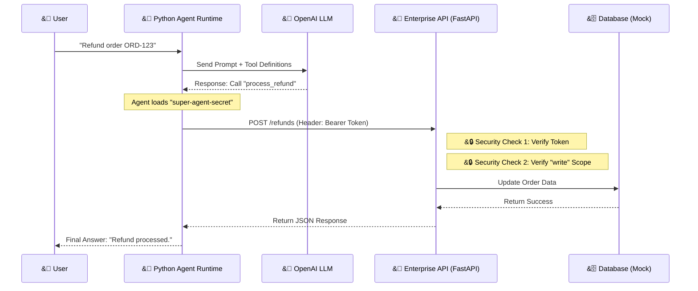

## Overview
This project is a hands-on demonstration of a "Forward Deployed Engineer (FDE)" architecture. It showcases how to bridge the gap between a deterministic Enterprise System (using **FastAPI** and **Pydantic**) and a probabilistic AI Agent (using **OpenAI Function Calling**).

Crucially, this demo implements **Zero Trust Security**. The AI Agent is not given admin access; it must authenticate using a **Bearer Token** and is restricted by **Role-Based Access Control (RBAC)** scopes.

### Key Technologies
| Component | Technology | Purpose in Architecture |
| :--- | :--- | :--- |
| **Enterprise API** | FastAPI (Python) | The asynchronous backend hosting the business logic. |
| **Security** | OAuth2 / Scopes | Enforces Least Privilege. The Agent needs specific scopes (e.g., `write:refunds`) to execute actions. |
| **Data Validation** | Pydantic | Enforces strict data contracts (schema) for inputs and outputs. |
| **The Brain** | OpenAI (GPT-4o-mini) | Acts as the reasoning engine to decide *which* tool to call. |
| **The Glue** | Python (`requests`) | The runtime that securely injects credentials and executes the AI's decision. |

---

## Architecture Diagram (Part 1: REST API)

This diagram illustrates the secure request flow for the REST API demo. Note that the LLM *decides* the action, but the Python Runtime *injects* the credentials before hitting the API.



## Prerequisites
* **Python 3.10+**: Ensure Python is installed and accessible via terminal.
* **OpenAI API Key**: You need a valid API key from `platform.openai.com`.

## Setup & Installation

### Clone or Create Project Folder
```bash
mkdir agent-fde-demo
cd agent-fde-demo
```

### Create and Activate Virtual Environment
```bash
# Create venv
python3 -m venv venv

# Activate it (Mac/Linux)
source venv/bin/activate
# Activate it (Windows)
# .\venv\Scripts\activate
```

### Install Dependencies
```bash
pip install fastapi uvicorn pydantic openai requests mcp anthropic
```

### Set OpenAI API Key
* **Mac/Linux:** `export OPENAI_API_KEY="sk-your-key-here"`
* **Windows:** `$env:OPENAI_API_KEY = "sk-your-key-here"`

---

## Part 1: Running the REST API Demo
This demo requires two separate terminal windows running simultaneously.

### &#128421;&#65039; Terminal 1: The Secure Server
This represents the Enterprise API with Role-Based Access Control.
Navigate to the folder and activate venv.

Run the server:
```bash
python main.py
```
*You should see: Uvicorn running on http://0.0.0.0:8000*

### &#129302; Terminal 2: The Authenticated Agent
This represents the Client Application.
Open a new terminal, navigate to folder, activate venv.

Run the agent:
```bash
python agent.py
```

### Testing Security Scenarios
This architecture demonstrates RBAC (Role-Based Access Control). You can modify `agent.py` to simulate different security levels.

**Scenario A: The "Super Agent" (Default)**
* Token: `super-agent-secret`
* Scopes: `read:orders`, `write:refunds`
* **Result:** The Agent successfully processes the refund.

**Scenario B: The "Junior Agent" (Permission Denied)**
1.  Open `agent.py`.
2.  Change line 10 to: `API_TOKEN = "junior-agent-secret"`
3.  Run `python agent.py`.
4.  **Result:**
    ```
    &#129302; LLM Thought: Call process_refund
    &#128268; Executing: process_refund...
    &#9989; API Result: Error: Permission Denied. You do not have the scope to perform this action.
    ```
This proves the API is protecting the database even if the AI tries to access it.

---

## &#129513; Part 2: Model Context Protocol (MCP) with RAG

This section covers the Model Context Protocol (MCP) implementation, updated with **Retrieval-Augmented Generation (RAG)**. This demonstrates a standardized Host <-> Client <-> Server architecture where the agent can consult a knowledge base before acting.

**&#9888;&#65039; Note on Security:** Unlike Part 1 (REST API), this MCP implementation currently operates **without Authentication or Authorization (AuthN/AuthZ)**. The Host trusts the Server implicitly over the stdio transport layer.

### Architecture Overview
In this lab, we simulate the full MCP lifecycle locally using Standard IO (stdio). The agent is now capable of "Reasoning" by reading documentation before taking action.

| MCP Role | File | Description |
| :--- | :--- | :--- |
| **MCP Host** | `mcp_host_client.py` | Acts as the AI Application. It includes the "Brain" (LLM) and the System Prompt that enforces a strict "Check Policy -> Act" workflow. |
| **MCP Server** | `mcp_server.py` | Acts as the Tool Provider. It exposes capabilities (`process_refund`) and a knowledge base search (`search_knowledge_base`). |
| **Ingestion** | `ingest.py` | (Optional) Pre-processes documents into a format the server can search. |

### MCP Flow Diagram with RAG
This updated diagram shows the agent consulting the Knowledge Base (RAG) before executing a transaction.

```mermaid
sequenceDiagram
    participant U as &#128100; User
    participant H as &#128421;&#65039; MCP Host (Client)
    participant S as &#128736;&#65039; MCP Server
    participant KB as &#128218; Knowledge Base (RAG)
    participant DB as &#128452; Database

    Note over H, S: Transport: Standard IO (No Auth)

    U->>H: "Refund order 123 for damage"
    
    Note right of H: System Prompt: "Check Policy First!"
    
    H->>S: Call Tool: search_knowledge_base(query="damage")
    S->>KB: Query Vector/Text Search
    KB-->>S: Return "Policy: Damage refund allowed < 30 days"
    S-->>H: Return Policy Details
    
    Note right of H: LLM Reasons: "Policy allows this."
    
    H->>S: Call Tool: process_refund(order_id="123")
    S->>DB: Execute Refund
    S-->>H: Return "Success"
    
    H-->>U: Final Answer: "Refund processed per policy."
```



### &#128640; Running the MCP Lab

**1. Install Additional Dependency**
```bash
pip install mcp anthropic openai
```
*(Ensure you have the relevant API key set in your environment variables)*

**2. Run the Host**
You only need to run the Host script. The Host automatically launches the Server as a subprocess.
```bash
python mcp_host_client.py
```

**3. Expected Output (Happy Path)**
```text
&#128268; Connecting to MCP Server...
&#9989; Connected! Found tools: ['search_knowledge_base', 'process_refund']

&#128100; Query: Refund ORD-123 because it arrived damaged.
&#129302; Agent decided to use 1 tool(s)...
   Executing: search_knowledge_base({'query': 'refund policy for damaged products'})
   Result: RELAVANT POLICY RULES: For cosmetic damage...

&#129302; Answer: I have verified the policy. Processing your refund now...
   Executing: process_refund({'order_id': 'ORD-123'})
   Result: Success.
```

### &#128736;&#65039; File Details

**The Server (`mcp_server.py`)**
Uses `@mcp.tool()` to expose Python functions. It now includes RAG capabilities.
```python
@mcp.tool()
async def search_knowledge_base(query: str) -> str:
    """Searches the internal documentation for policies."""
    # ... Implementation ...
```

**The Host (`mcp_host_client.py`)**
This is the "Brain" that orchestrates the logic. It includes a specific System Prompt to prevent hallucinations and enforce policy checks.
```python
SYSTEM_PROMPT = """
CRITICAL WORKFLOW:
1. VERIFY FIRST: Use `search_knowledge_base`
2. CHECK ELIGIBILITY
3. EXECUTE: Call `process_refund` ONLY if allowed.
"""
```

### &#129504; Key Takeaways
* **RAG + Actions:** The agent doesn't just chat; it uses read-only tools (Search) to inform write-access tools (Refunds).
* **Bureaucratic Agents:** By manipulating the System Prompt in the Host, we can force the AI to follow strict corporate procedures (Search -> Verify -> Act).
* **No Auth:** In this local MCP piping, security relies on the host environment. In a production implementation, you would need to wrap the MCP transport in a secure layer.
