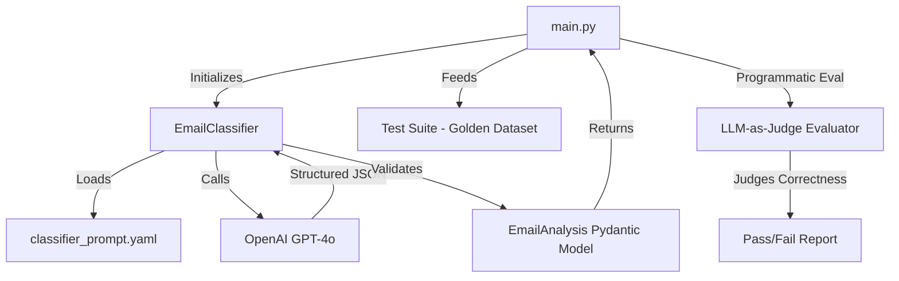

# SaaS Email Classifier & Evaluator

This directory contains a robust, structured output email classification system with integrated programmatic evaluation (LLM-as-Judge).

## 🏗️ Architecture

The system is designed with a clear separation of concerns, utilizing Pydantic for data validation and LangChain for LLM orchestration.



## 📂 Component Overview

### 1. `email_analyzer.py`
The core logic engine.
- **`EmailAnalysis` (BaseModel)**: Defines the strict JSON schema for output, including `category`, `priority`, `summary`, and `confidence`.
- **`EmailClassifier`**:
    - Uses `PydanticOutputParser` to enforce schema compliance.
    - Implements retry logic for low-confidence scores (< 0.7).
    - Decouples the prompt by loading it from an external YAML file.

### 2. `classifier_prompt.yaml`
A version-controlled prompt template that defines the AI's persona, context, and classification rules. Using a separate file allows for easy prompt engineering without touching the code.

### 3. `main.py`
The execution and verification layer.
- **Batch Processing**: Runs the classifier against a "Golden Dataset" of diverse test cases.
- **LLM-as-Judge**: Uses a high-capability model (GPT-4o) and the `labeled_criteria` (correctness) evaluator to audit the classifier's performance automatically.

## 🚀 Getting Started

1. **Environment Setup**:
   Ensure you have an `.env` file in the root directory with your `OPENAI_API_KEY`.

2. **Run the Pipeline**:
   ```bash
   python 02_structured_output/main.py
   ```

## 📊 Evaluation Metrics
The system doesn't just classify; it explains. The programmatic evaluator provides detailed reasoning for every "Pass" or "Fail", allowing for rapid iteration on the underlying prompt or classification logic.
