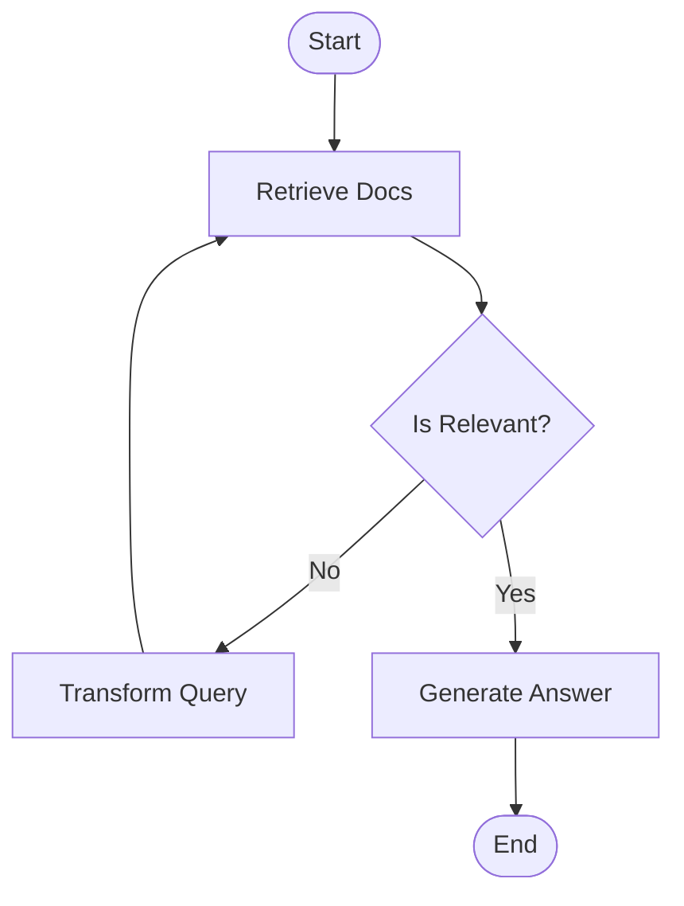

# 🤖 Week 5: Agent Orchestration (The "Glass Box" Agent)

This module marks the final evolution from linear RAG pipelines to **Self-Correcting Agentic Workflows**. We move beyond "Black Box" chains where failures are silent, to a **"Glass Box"** architecture built with **LangGraph** and **ArangoDB**.

## 🧠 Key Concepts

### 1. Self-Correcting RAG (CRAG)
Unlike traditional RAG, a self-correcting agent evaluates the quality of its own retrievals. If the retrieved data is irrelevant or of poor quality, the agent "pivots," transforms the search query, and tries again.

### 2. The "Glass Box" Architecture
- **Retrieve**: Pulls context from ArangoDB using vector search.
- **Grade (The Critic)**: A dedicated node that strictly audits the relevance of retrieved documents.
- **Transform (The Pivot)**: Rewrites the user query into a more effective search term if the grader fails.
- **Generate**: Produces the final response only after the facts have been validated.

### 3. Schema Enforcement
We utilize ArangoDB 3.12+ **Inverted Indexes** for high-performance vector search, ensuring our agent has a stable and predictable knowledge base.

## 📂 Notebooks

- **[Self-Correcting RAG.ipynb](file:///Users/snudurupati/Projects/agentic-ai-architect/05_agent_orchestration/Self-Correcting%20RAG.ipynb)**: The complete, final implementation of the self-correcting agent workflow.
- **[agentic_ai_architect_week_WIP.ipynb](file:///Users/snudurupati/Projects/agentic-ai-architect/05_agent_orchestration/agentic_ai_architect_week_WIP.ipynb)**: Detailed implementation of the LangGraph state machine and conditional logic flows.

## 🏗️ Getting Started

### Prerequisites
1. **ArangoDB 3.12+**: Ensure your instance is running (preferably via Docker as shown in [Week 4](../04_advanced_rag/README.md)).
2. **Environment Variables**: A `.env` file with `ARANGO_URL`, `ARANGO_PASSWORD`, and `OPENAI_API_KEY`.

### Workflow Visualization

## 🛠️ Data Infrastructure
This module assumes the `glass_box` database and `kb_nodes` collection are populated. If you haven't already, run the data generator from the previous module.
